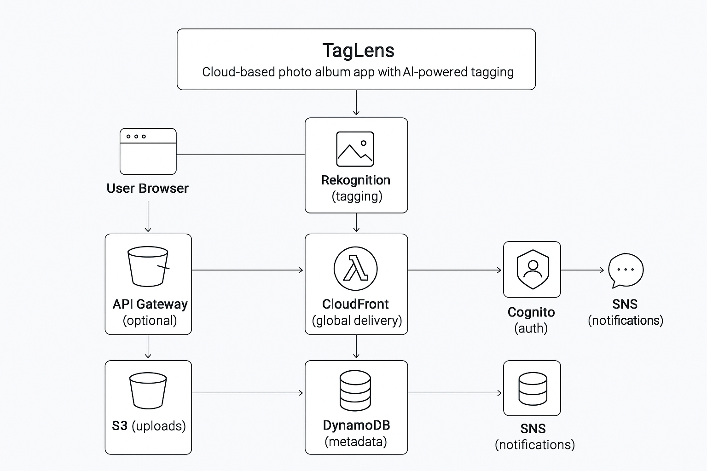

# TagLens

TagLens is a cloud-based photo album app with AI-powered tagging, built on a secure, scalable AWS serverless architecture.

## Features
- Upload photos from browser
- AI tagging (people, objects, locations) using AWS Rekognition
- Store images in S3
- Metadata in DynamoDB
- Global image delivery via CloudFront
- User authentication with Cognito
- Image resizing/optimization with Lambda
- Sharing notifications via SNS
- Search albums by tags

## App Details
TagLens provides a modern web interface for uploading, searching, and sharing photos. Each photo is automatically tagged using AWS Rekognition, and metadata is stored in DynamoDB for instant search. Images are delivered globally via CloudFront for fast access.

### Main Components
- **Frontend**: HTML, CSS, JS (AJAX forms, tag display)
- **Backend**: PHP (AWS SDK integration, routing, authentication)
- **AWS Services**: S3, Rekognition, DynamoDB, Lambda, CloudFront, Cognito, SNS


## Architecture Overview

```
User Browser
	|
	v
API Gateway (optional)
	|
	v
S3 (uploads) ---> Lambda (resize/optimize) ---> S3 (processed)
	|                                      |
	|                                      v
	|                              DynamoDB (metadata)
	|                                      |
	v                                      v
CloudFront (global delivery)         Rekognition (tagging)
	|
	v
Cognito (auth) <--- SNS (notifications)
```

## AWS Deployment Steps

1. **Create S3 Buckets**
	- `your-photo-bucket` for original uploads
	- `your-photo-processed-bucket` for resized images
2. **Set up AWS Lambda**
	- Create a Lambda function to process/resize images on S3 upload events
	- Grant Lambda permissions for S3, Rekognition, DynamoDB
3. **Configure Rekognition**
	- Enable Rekognition in your AWS account
	- Grant access to Lambda and PHP backend
4. **Create DynamoDB Table**
	- Table name: `your-photo-metadata-table`
	- Partition key: `key` (string)
	- Attribute: `labels` (string set)
5. **Set up CloudFront**
	- Create a CloudFront distribution for your S3 bucket
	- Enable caching and HTTPS
6. **Configure Cognito**
	- Create a Cognito User Pool for authentication
	- Integrate with PHP backend
7. **Set up SNS**
	- Create an SNS topic for sharing notifications
	- Grant publish permissions to backend
8. **(Optional) API Gateway**
	- Create REST API for uploads/search if needed

## Service Configuration Notes
- Update `src/aws_config.php` with your AWS region and credentials
- Replace bucket names, table names, and ARNs in `src/aws.php` and `src/photo.php`
- Use IAM roles for Lambda and backend security
- Set S3 bucket policies for privacy and access control

## Running Locally
1. Install PHP and Composer
2. Run `composer require aws/aws-sdk-php`
3. Start a local PHP server:
	```
	php -S localhost:8080 -t src
	```
4. Open `http://localhost:8080` in your browser

## Learning Outcomes
- Build event-driven serverless architectures
- Integrate AWS services with PHP
- Secure cloud apps with IAM and Cognito
- Deliver images globally with CloudFront

---
For questions or deployment help, see AWS documentation or contact the project maintainer.
